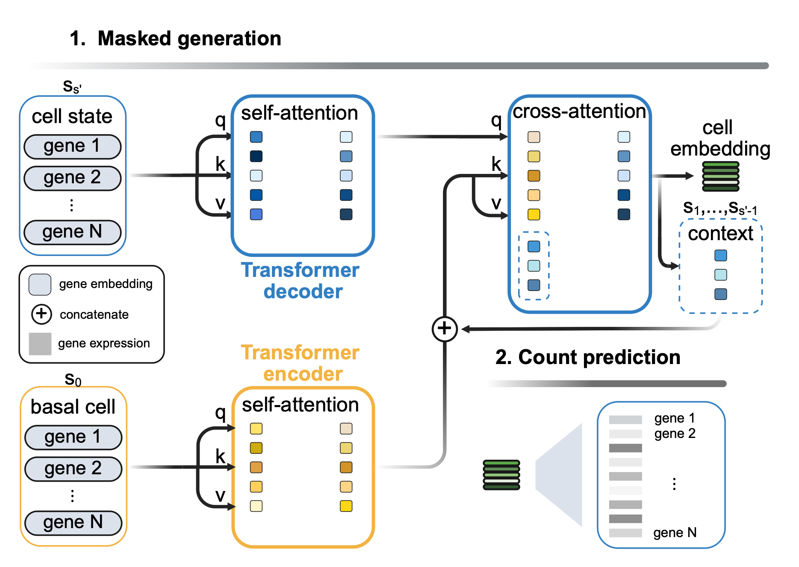

 [](https://opensource.org/licenses/MIT)
 


# PerturbGen Foundation model for dynamic cellular states



## 1. Usage

First, clone the repo and change to the project directory.

```shell
git clone https://github.com/Lotfollahi-lab/Perturbgen.git
```

Install Poetry (one-time):
(wanna know what is poetry? have a look at https://python-poetry.org)
```shell
curl -sSL https://install.python-poetry.org | python3 -
```
Optional: alternative way to install poetry using pipx (https://pipx.pypa.io/stable/installation/)
```shell
pipx install poetry
```

Create/install the environment and dependencies:
```shell
cd Perturbgen
poetry env use python3.11
poetry install
```

Activate the enviroment
```shell
source "$(poetry env info -p)/bin/activate"
```

The project contains some jupyter notebooks, which were converted to python files
due to better handling in the repository.
These files end with `_nb.py` and can be converted back to a `.ipynb` file with
`jupytext`:

```shell
jupytext --to ipynb --execute <your_file>_nb.py
```
## Examples

For usage, see:
- [Preprocessing and data curation](docs/examples/01_preprocessing_curation.ipynb)
- [Tokenization and pairing](docs/examples/02_tokenization_pairing.ipynb)
- [Train PerturbGen](docs/examples/03_train_perturbgen.ipynb)
- [Gene Embedding Extraction](docs/examples/04_GeneEmbedding_Extraction.ipynb)
- [Gene Program Discovery](docs/examples/05_GeneProgram_Discovery.ipynb)
- [Perturbation](docs/examples/06_perturbation.ipynb)
- [Post Perturbation Analyses](docs/examples/07_PostPerturbation_Analyses.ipynb)

## Citation

If you use our repository or code in your research, please cite us:

```

```
